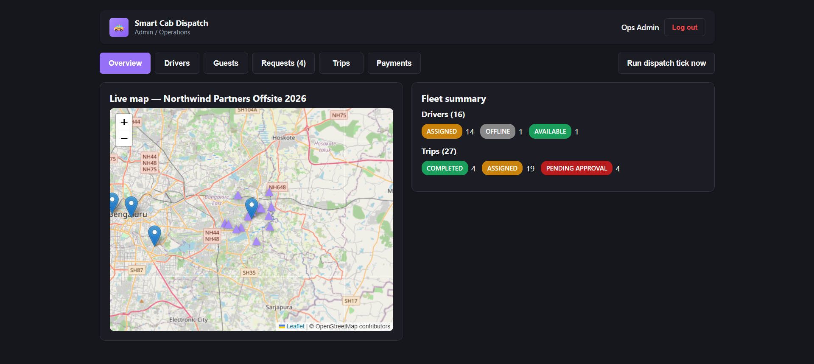
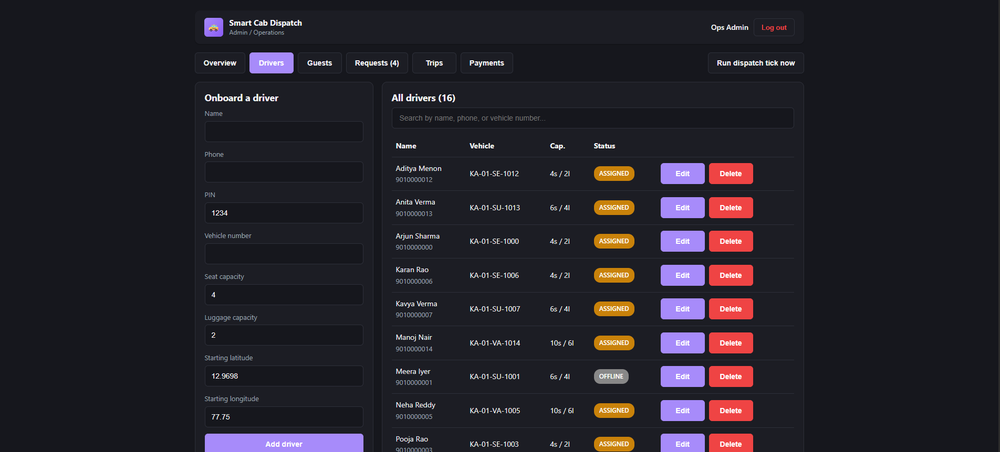
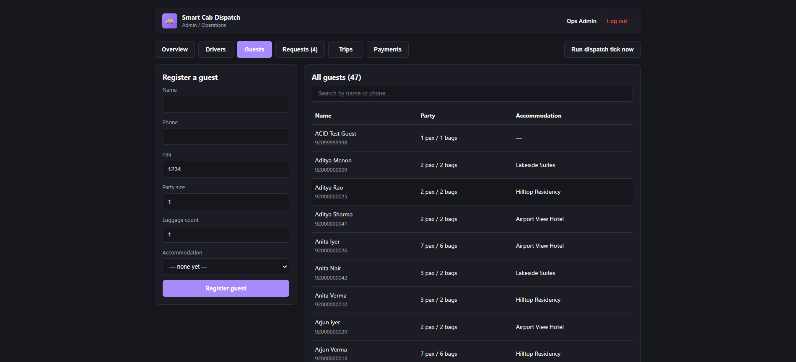
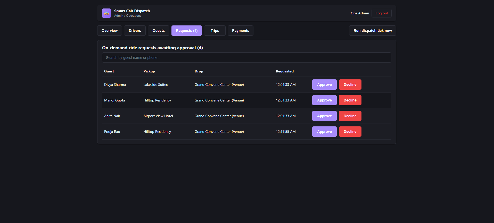
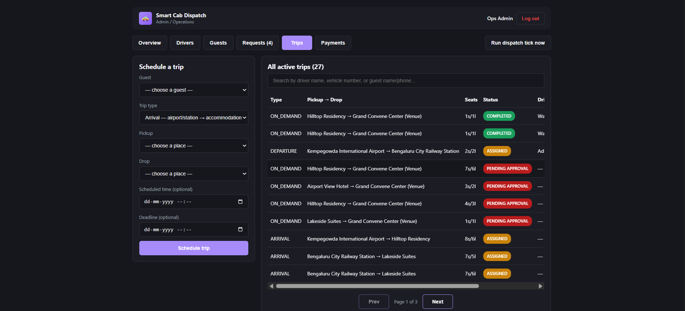
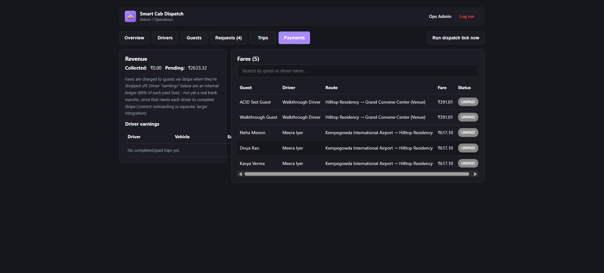
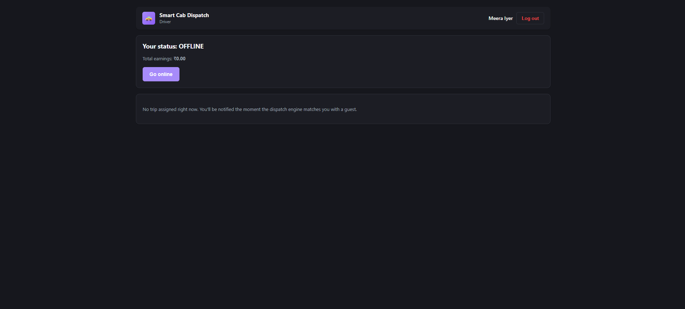
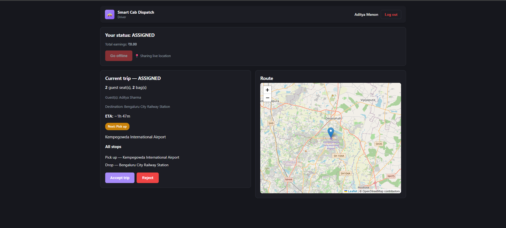
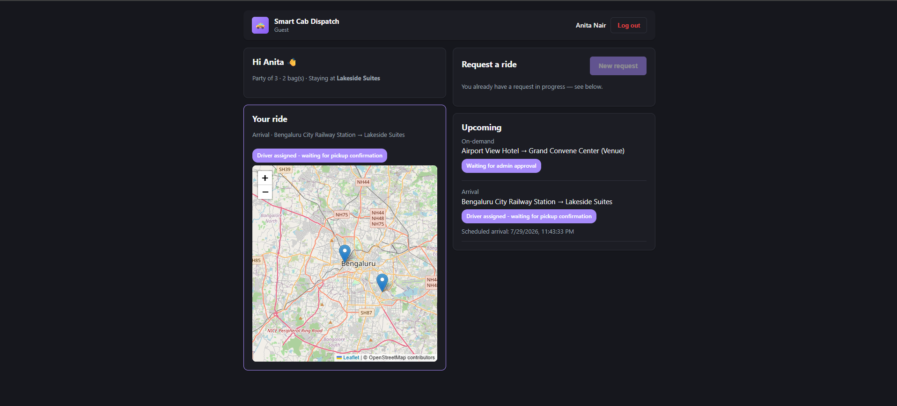

# Smart Cab / Vehicle Dispatch System

Automated driver-guest dispatch for a single private group event
(conference/offsite) — a guest mobile app, an Admin/Operations + Driver
portal, and a backend matching engine that assigns drivers to guests
automatically. Neither guests nor drivers ever browse or pick a match; the
engine does it, and admin only approves/declines ad-hoc requests or manually
overrides when needed.

See [`docs/DESIGN.md`](docs/DESIGN.md) for the matching algorithm, trade-offs,
and data model in depth. This file is the practical "how do I run it" guide.
See [`WALKTHROUGH.txt`](WALKTHROUGH.txt) for a full live run-through (fresh
admin/driver/guest accounts, a trip through its whole lifecycle, a fare, and
RBAC/security checks — all against the real running app, not simulated) and
[`DEPLOYMENT.txt`](DEPLOYMENT.txt) for a from-scratch, step-by-step guide to
deploying the backend on Render and the frontend on Vercel.












## What's in it

- **Automated matching** — nearest-driver, capacity-aware assignment
  (prefers the best-fitting vehicle among reasonably-close options, not just
  the closest one, so a nearby van doesn't get wasted on a 1-seat trip), a
  wait-time/deadline priority queue so no one is starved, same-destination
  ride clustering, fleet-escalation splitting for oversized parties, and
  opportunistic detour insertion into drivers already en route — all
  re-optimized automatically every 15 seconds and after key actions.
- **Real-time tracking** — Socket.IO push for driver position, live-ticking
  ETA countdowns, and an animated/rotating vehicle marker on the map (no
  teleporting between GPS updates).
- **Multi-stage trip types** — arrival (airport/station → accommodation), to
  venue, return, and departure, schedulable by admin or requested on-demand
  by guests (which route through an admin approval step first).
- **Payments** — per-guest fare computed on drop-off, charged via Stripe
  (test mode), with a driver earnings ledger and an admin revenue view. Fully
  optional — see [Payments](#payments) below.
- **Push notifications**, a 3D sign-in intro, dark mode, and responsive
  layouts across mobile/tablet/desktop in both frontends.

## Structure

```
backend/        Express + Socket.IO API, Prisma/SQLite, matching engine
admin-portal/   React app — ONE app, ONE login, all three roles (RBAC)
guest-app/      Superseded - see note below
docs/DESIGN.md  Design document (algorithm, data model, trade-offs)
```

There's a single sign-in page for everyone — Admin, Driver, and Guest all log
in at the same URL with their own phone/PIN, and land on the view scoped to
their role. `guest-app`'s functionality now lives inside `admin-portal` too,
so you no longer need to run two frontends to exercise all three roles.

**`guest-app` no longer works standalone.** The auth hardening below
(httpOnly session cookie) means `/auth/login` no longer returns a raw token
in its response body at all — `guest-app`'s own `AuthContext` still expects
one and was not updated, since the unified `admin-portal` is the
supported path going forward. It's kept in the repo for reference, not as a
working alternative deployment.

## Prerequisites

- Node.js 20+ and npm
- No external API keys required to run the demo — maps/routing and payments
  both have working built-in fallbacks (see [Maps / ETA provider](#maps--eta-provider)
  and [Payments](#payments))

## 1. Backend

```bash
cd backend
npm install
npm run prisma:generate   # generate Prisma client
npm run prisma:migrate    # create/apply the SQLite schema (first run only)
npm run seed               # wipes and reseeds demo data (event, drivers, guests)
npm run dev                 # starts the API on http://localhost:4001
```

The seed script prints demo login credentials each run (names are shuffled,
phone numbers are always sequential):

```
Admin login   -> phone: 9000000001  pin: admin123
Driver login  -> phone: 9010000000  pin: 1234   (15 seeded drivers total)
Guest login   -> phone: 92000000000 pin: 1234   (45 seeded guests total)
```

Useful endpoints while developing:
- `GET /health` — liveness check
- `POST /admin/dispatch/tick` — manually trigger a full re-optimization pass
  (the engine also runs automatically every 15s and after key actions)
- `POST /admin/dispatch/run-batch` — run just the nearest-driver batch
  assignment step on its own
- `POST /webhooks/stripe` — Stripe payment confirmation webhook (see
  [Payments](#payments))

Run the Hungarian-solver unit tests + a live assignment sanity report:

```bash
npm run test
```

## 2. The app (Admin/Operations, Driver, and Guest — one sign-in)

```bash
cd admin-portal
npm install
npm run dev   # http://localhost:5173 (Vite picks the next free port if taken)
```

Open it and sign in with **any** seeded phone/PIN — admin, driver, or guest —
same URL, same login form. What you see after signing in is entirely
determined by the account's role, both in what renders and in what the
backend will actually let that session's requests touch:

- **Admin** → full operations dashboard: live map, driver onboarding, guest
  registration, trip scheduling, on-demand request approvals, manual
  override, payments/revenue view.
- **Driver** → single-trip view: accept/reject, mark arrived → board/drop per
  stop, live location sharing, earnings. Structurally cannot see the
  operational dashboard or any other driver's trip.
- **Guest** → pickup details (flight/train ETA, pickup point, accommodation),
  match notifications, live driver tracking on a map, paying a completed
  trip's fare, and raising an on-demand ride request.

This role separation isn't just hidden UI — every `/admin/*`, `/driver/*`,
and `/guest/*` backend route independently re-checks the session's role and
(for drivers/guests) scopes every query to that specific driver/guest ID, so
a Driver-role session cannot fetch the admin dashboard's data even by calling
the API directly.

## How it works — a worked example

Say a guest, Sneha, needs a ride from her hotel to the venue mid-afternoon,
outside her originally scheduled pickup.

1. **Guest requests a ride.** Sneha logs in as a guest, hits "New request,"
   picks "Hilltop Residency" as pickup and "Grand Convene Center" as drop
   from the seeded `Place` list, and submits. This creates a `Trip` with
   `origin: "ON_DEMAND"` and `status: "PENDING_APPROVAL"` — it does **not**
   touch the dispatch engine yet.

2. **Admin approves it** (same app, Admin login, "Requests" tab). Approving
   flips the trip to `QUEUED` and immediately fires a dispatch tick rather
   than waiting for the next automatic pass.

3. **The dispatch engine matches a driver** (`backend/src/engine/matchingEngine.ts`).
   A tick runs automatically every 15s and also after key actions. Each tick:
   splits any trip too big for one vehicle, clusters same-destination trips
   into shared rides, tries an opportunistic detour into a driver already en
   route, and otherwise assigns each queued trip (most-urgent-first) to the
   best-fitting nearby available driver — never wasting an oversized vehicle
   on a small trip when a right-sized one is reasonably close, and never
   forcing a guest to wait past a sane ETA ceiling just for a "perfect" fit.

   Say driver Arjun is the best match — he gets assigned. His status flips to
   `ASSIGNED`, the trip's status flips to `ASSIGNED`, and both a socket event
   and a push notification reach his phone/browser immediately (no polling
   delay).

4. **Driver drives** (same app, Driver login). Arjun accepts, then for
   each stop: "Mark arrived" (records the exact arrival time, so halt/wait
   time is measurable) → "Confirm guest boarded" (or dropped). Location is
   shared automatically and continuously for the whole trip, not a manual
   toggle he has to remember. Sneha's guest view shows Arjun's name, vehicle
   number, live position, and a live-ticking ETA the whole time.

5. **Drop-off and payment.** The moment Sneha is dropped off, her fare is
   computed and (if Stripe is configured) she can pay it right from the app.
   Arjun is put on a mandatory rest break, then automatically flips back to
   `AVAILABLE` for the next tick to assign him again.

Throughout, the **Admin/Operations dashboard** sees everything at once: the
live map, fleet/trip status, the payments ledger, and a manual "Override
assign" escape hatch (with its own capacity/double-booking checks) for
anything the algorithm can't place automatically.

## Maps / ETA provider

By default, `backend/.env` has `GOOGLE_MAPS_API_KEY` empty, so the backend
uses a built-in Haversine-distance + simulated-traffic ETA model (no network
calls, deterministic enough to test against — see
`backend/src/lib/distanceProvider.ts`). To use real Google Distance Matrix
data instead, set `GOOGLE_MAPS_API_KEY` in `backend/.env` and restart the
backend; it falls back to the built-in model automatically if the API call
fails, and caches repeated queries for the same pair within a 5-minute window
either way, to avoid excessive paid API usage from frequent driver GPS pings.
Both frontends render maps with Leaflet + OpenStreetMap tiles, which need no
API key.

## Payments

Guests are charged a fare (base fare + per-km, computed from pickup→drop
distance) via Stripe when they're dropped off. This is **off by default** —
without `STRIPE_SECRET_KEY` set, fares still compute and show everywhere
(guest app, admin Payments tab, driver earnings), they just can't be charged.

To enable it, get a free Stripe **test-mode** key (no business verification
required) at https://dashboard.stripe.com/test/apikeys and set:
- `backend/.env` — `STRIPE_SECRET_KEY` (starts `sk_test_...`)
- `guest-app/.env` — `VITE_STRIPE_PUBLISHABLE_KEY` (starts `pk_test_...`)

Payment confirmation is webhook-driven (never trust a client-side "success"
alone): point a webhook at `POST /webhooks/stripe` and set
`backend/.env`'s `STRIPE_WEBHOOK_SECRET` to its signing secret. For local
dev, the [Stripe CLI](https://stripe.com/docs/stripe-cli) makes this easy:

```bash
stripe listen --forward-to localhost:4001/webhooks/stripe
```

**Scope boundary:** driver "earnings" (visible in the admin Payments tab and
the driver's own view) are an internal ledger (80% of each paid fare), not a
real bank transfer. Actually paying out to drivers would need Stripe Connect
with per-driver onboarding — a separate, larger integration than a private
event's fleet needs by default, so it's intentionally not built here. See
`docs/DESIGN.md` §9 for the full reasoning.

## Security

Sign-in is hardened beyond a bare JWT-in-localStorage setup:

- **httpOnly session cookie, not localStorage.** `/auth/login` sets the JWT
  as an `httpOnly` cookie (`backend/src/middleware/auth.ts`) — it's never
  present in the JSON response body and never touched by frontend
  JavaScript, so an XSS payload has nothing to read via `document.cookie` or
  `localStorage`. The Socket.IO handshake authenticates off the same cookie
  (`withCredentials`), so there's no separate token floating around either.
  CORS is locked to specific origins (required for credentialed cookies to
  work at all — a wildcard `*` origin is rejected by browsers here). The
  cookie's `SameSite` attribute adapts automatically: `lax` in local dev
  (frontend/backend differ only by port, which browsers treat as the same
  site) and `none` (plus `secure`) in production, since a real deployment
  typically puts the frontend and backend on different domains — see
  [`DEPLOYMENT.txt`](DEPLOYMENT.txt).
- **Rate limiting + per-account lockout.** `/auth/login` is throttled per-IP
  (20 attempts/15 min) and additionally locks out a specific phone number for
  15 minutes after 5 failed attempts, so a distributed attacker rotating IPs
  can't bypass the per-IP limit to brute-force one account.
- **Timing-safe lookup.** A login for a phone number that doesn't exist still
  runs a full `bcrypt.compare` against a dummy hash, so response time doesn't
  leak which phone numbers are actually registered.
- **Generic error messages** ("Invalid phone or PIN") regardless of whether
  the phone exists or the PIN was wrong, for the same reason.
- **RBAC enforced server-side, not just in the UI** — see [Role separation](docs/DESIGN.md#10-role-separation-rbac).
- **Unique identity.** Every record is keyed by an opaque `cuid()`, never a
  guessable auto-increment integer. `phone` (the login identifier) is
  DB-unique, and a `User`'s `driverId`/`guestId` foreign keys are themselves
  unique, so one phone number can never map to more than one role or record.

## Architecture & scalability

- **Indexing** — every field actually used as a query predicate on a
  frequent path is indexed (`Driver.status`/`Trip.status` for the 15s
  dispatch loop, `Trip.driverId`, `TripGuest.guestId` for the guest view's
  5s poll, `TripGuest.stripePaymentIntentId` for the payment webhook) —
  and nothing else, since an index nothing queries is pure write-cost.
- **Caching** — a small `Cache` interface (`backend/src/lib/cache.ts`) with
  one in-memory implementation today, used for the single `Event` config row
  (re-fetched on every dispatch tick otherwise) and the admin Payments
  aggregate query. Every call site depends on the interface, not the
  implementation, so a `RedisCache` for a multi-instance deployment is a new
  class, not a rewrite. Live trip/driver data is deliberately *not* cached —
  dispatch decisions need it fresh.
- **ACID payments** — fare computation, PaymentIntent creation, and the
  Stripe webhook's payment-status + driver-earnings-credit are wrapped in
  DB transactions with idempotency guards, so a crash mid-write or a
  redelivered webhook event (Stripe only guarantees *at-least-once*
  delivery) can't double-charge, double-credit, or leave partial state. See
  [`docs/DESIGN.md` §9](docs/DESIGN.md#9-payments) for exactly how, and
  [`WALKTHROUGH.txt`](WALKTHROUGH.txt) for a live test proving a replayed
  webhook event credits a driver exactly once.
- **SOLID structure** — login is split by responsibility: `AuthService`
  (verifies credentials) depends on a `LoginAttemptTracker` *interface*
  (lockout policy) via constructor injection, not a concrete implementation,
  and knows nothing about HTTP; the Express route is pure request/response
  glue. See [`docs/DESIGN.md` §10-11](docs/DESIGN.md#10-role-separation-rbac)
  for the full breakdown and the scalability rationale behind it.

## Environment files

Each app has its own `.env` (already populated with working local defaults):

| File | Variables |
|---|---|
| `backend/.env` | `DATABASE_URL`, `JWT_SECRET`, `PORT`, `GOOGLE_MAPS_API_KEY` (optional), `STRIPE_SECRET_KEY` (optional), `STRIPE_WEBHOOK_SECRET` (optional), `CORS_ORIGIN` (optional, comma-separated extra allowed origins beyond localhost) |
| `admin-portal/.env` | `VITE_API_URL`, `VITE_STRIPE_PUBLISHABLE_KEY` (optional) |
| `guest-app/.env` | Only relevant if you still run the standalone guest-app; same variables as before |

## Known limitations (see docs/DESIGN.md §12 for the full list)

- Driver payouts are a ledger, not a real transfer (see [Payments](#payments)).
- No real push-notification service worker — browser Notification API only,
  so it requires the app to have been opened at least once and permission
  granted; there's no offline/background delivery.
- Frontends are verified by type-checking, production builds, and extensive
  manual/live API integration testing throughout development (login,
  dispatch tick, approve/decline, driver accept → arrive → board → drop →
  complete, payments, guest live tracking, RBAC 401/403 checks) — but not
  with an actual browser automation tool in this environment. If something
  looks visually off after `npm run dev`, that's the first place to check.
